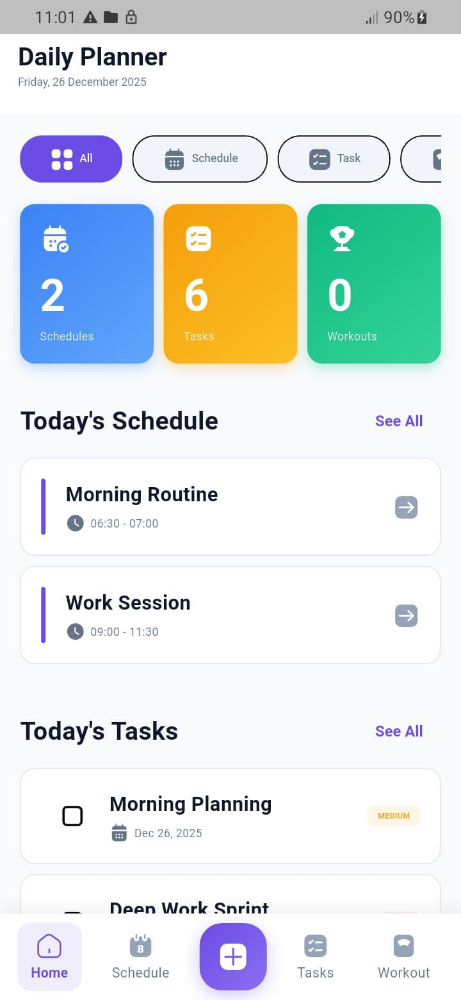
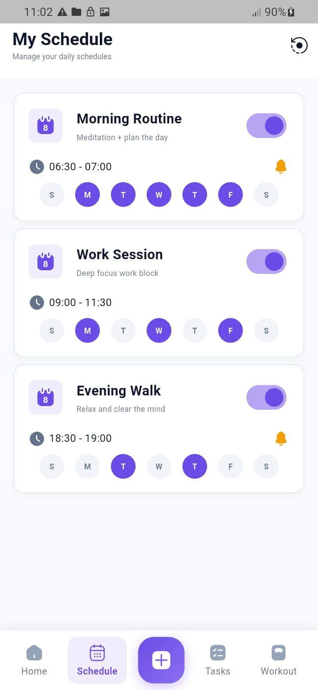
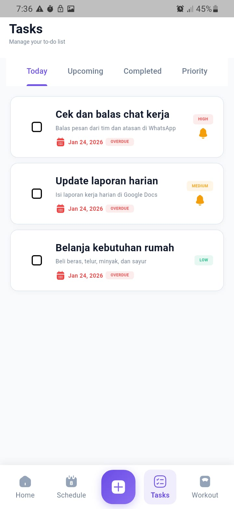
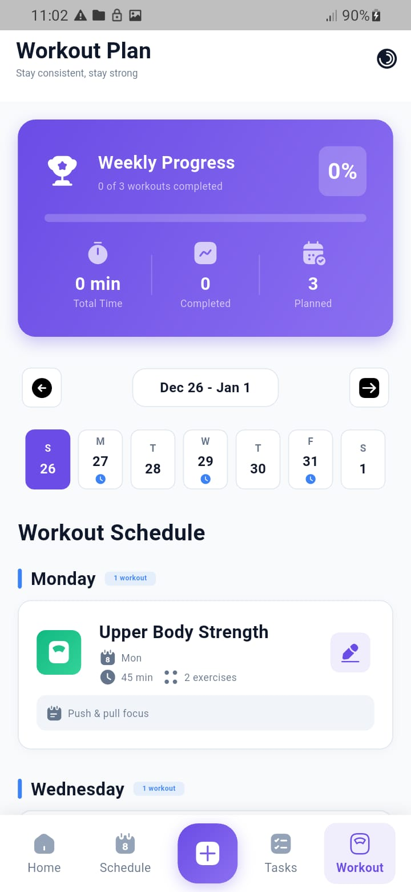
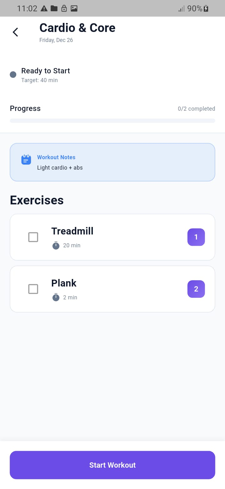
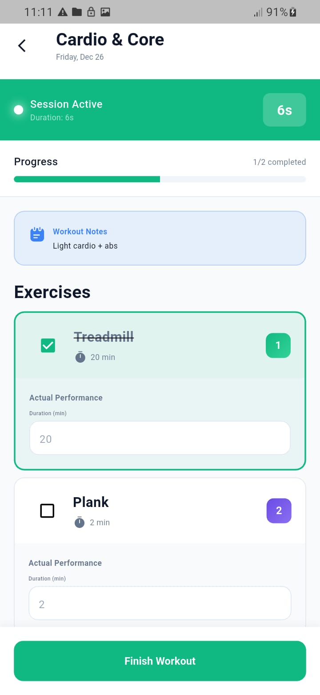
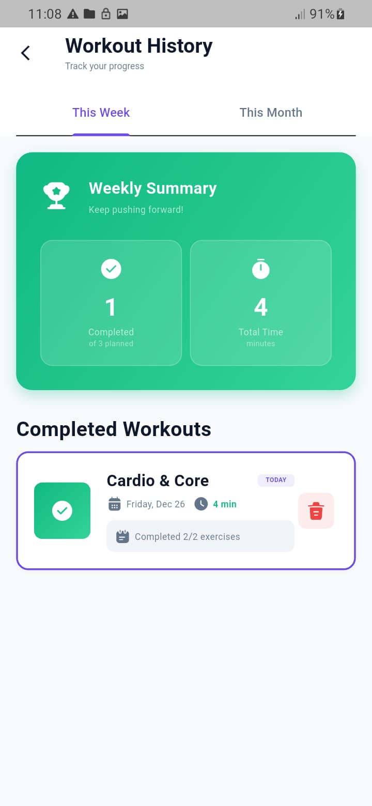

# 📱 Daily Planner + Workout Tracker

Aplikasi pengelola jadwal harian dan pelacak workout yang modern dan kaya fitur, dibangun dengan Flutter. Aplikasi ini membantu Anda mengatur jadwal harian, mengelola tugas, dan melacak rutinitas workout - semua dalam satu tempat.


## ✨ Fitur

### 📅 Manajemen Jadwal
- **Buat dan kelola jadwal harian** dengan slot waktu spesifik
- **Auto-fill waktu selesai**: Waktu selesai otomatis terisi +30 menit dari waktu mulai (maksimal 23:59)
- **Atur jadwal berulang** untuk hari-hari tertentu dalam seminggu
- **Mode Bootcamp**: Atur waktu berbeda untuk setiap hari
  - Contoh: Senin 17:00-19:00, Rabu 18:30-20:30, Jumat 16:00-18:00
  - Satu jadwal dapat memiliki jam berbeda per hari
- **Periode aktif opsional**: Tentukan rentang tanggal mulai dan berakhir jadwal
  - Tidak diisi → aktif mulai hari ini tanpa batas waktu
  - Isi start date saja → aktif mulai tanggal tersebut tanpa batas akhir
  - Isi end date saja → aktif dari sekarang sampai tanggal berakhir
  - Isi keduanya → jadwal hanya aktif di antara rentang tanggal tersebut
  - Validasi otomatis: end date harus lebih besar dari start date
- **Checklist harian**: Tandai jadwal yang sudah selesai hari ini
  - Checklist otomatis reset setiap hari berganti
  - Status checklist tersimpan per tanggal
  - Minggu ini dicentang ≠ minggu depan
- **Toggle aktif/nonaktif** tanpa perlu menghapus jadwal
- **Notifikasi pengingat** untuk acara yang akan datang
- **Lihat semua jadwal hari ini** dalam satu tampilan

### ✅ Manajemen Tugas
- Buat tugas dengan tanggal jatuh tempo dan tingkat prioritas (Rendah, Sedang, Tinggi)
- Filter tugas berdasarkan: Hari Ini, Mendatang, Selesai, Prioritas
- Tandai tugas sebagai selesai dengan satu ketukan
- Dapatkan notifikasi sebelum tenggat tugas
- Lacak tugas yang terlambat secara otomatis

### 💪 Pelacakan Workout
- Rencanakan rutinitas workout mingguan untuk setiap hari
- Buat workout kustom dengan berbagai latihan
- Lacak detail latihan: set, repetisi, durasi, beban
- Catat workout yang selesai dengan durasi aktual dan catatan
- Lihat statistik workout mingguan dan bulanan
- Pantau penyelesaian workout dengan indikator visual
- Akses riwayat workout lengkap

### 🏠 Dashboard Beranda Terpadu
- Lihat semua aktivitas hari ini dalam satu tempat
- Filter tampilan berdasarkan Jadwal, Tugas, atau Workout
- Akses cepat untuk membuat entri baru
- Lihat statistik kunci dan progres

## 📸 Screenshot

### Layar Beranda


*Dashboard utama menampilkan jadwal, tugas, dan workout hari ini*

### Manajemen Jadwal


*Kelola jadwal harian Anda dengan opsi berulang*

### Manajemen Tugas


*Atur tugas berdasarkan prioritas dan tanggal jatuh tempo*

### Pelacakan Workout


*Perencana workout mingguan dengan indikator status*

### Sesi Workout



*Selesaikan workout Anda langkah demi langkah dengan pelacakan langsung*

### Riwayat Workout


*Lacak progres workout Anda dari waktu ke waktu*

## 🏗️ Arsitektur

<pre>
lib/
├── core/
│   ├── constants/       # Konstanta aplikasi
│   └── utils/          # Utilitas pembantu
├── data/
│   ├── models/         # Model data
│   ├── repositories/   # Logika layer data
│   └── services/       # Layanan Database & Notifikasi
├── providers/          # Manajemen state (pola Provider)
└── ui/
    ├── routes/         # Navigasi (AutoRoute)
    ├── screens/        # Layar aplikasi
    ├── widgets/        # Komponen UI yang dapat digunakan kembali
    └── theme/          # Tema aplikasi
</pre>

### Teknologi Utama

- **Manajemen State:** Provider
- **Navigasi:** AutoRoute
- **Database Lokal:** SQLite (sqflite)
- **Notifikasi:** flutter_local_notifications
- **Arsitektur:** MVVM dengan pola Repository

## 🚀 Memulai

### Prasyarat

- Flutter SDK (3.0 atau lebih tinggi)
- Dart SDK (3.0 atau lebih tinggi)
- Android Studio / VS Code dengan ekstensi Flutter
- Perangkat Android atau emulator (Android 6.0+)
- Perangkat iOS atau simulator (iOS 12.0+) [opsional]

### Instalasi

1. **Clone repositori**
```bash
git clone https://github.com/Asadell/routify_app.git
cd routify_app
```

2. **Install dependensi**
```bash
flutter pub get
```

3. **Generate file route** (jika menggunakan AutoRoute)
```bash
dart run build_runner build -d
```

4. **Jalankan aplikasi**
```bash
flutter run
```

## 📦 Dependensi
```yaml
dependencies:
  flutter:
    sdk: flutter
  change_app_package_name: ^1.5.0               # Ubah nama paket aplikasi Android/iOS dengan mudah
  auto_route: ^11.1.0                           # Navigasi & manajemen route
  flutter_animate: ^4.5.2                       # Animasi mudah & indah
  intl: ^0.20.2                                 # Format tanggal, angka & lokalisasi
  sqflite: ^2.4.2                               # Database SQLite lokal
  path: ^1.9.1                                  # Utilitas path file (digunakan dengan SQLite dll.)
  provider: ^6.1.5+1                            # Manajemen state
  flutter_local_notifications: ^19.5.0          # Notifikasi lokal (Android & iOS)
  timezone: ^0.10.1                             # Dukungan zona waktu untuk penjadwalan notifikasi
  sizer: ^3.1.3                                 # UI responsif berdasarkan ukuran layar
  iconsax_flutter: ^1.0.1                       # Paket ikon Iconsax
  flutter_launcher_icons: ^0.14.4               # Generate ikon peluncur aplikasi

dev_dependencies:
  flutter_test:
    sdk: flutter
  flutter_lints: ^6.0.0                         # Aturan lint & praktik terbaik yang direkomendasikan
  build_runner: ^2.10.4                         # Runner generator kode (untuk auto_route, dll.)
  auto_route_generator: ^10.4.0                 # Generator kode untuk AutoRoute
```

## 🎨 Filosofi Desain

Aplikasi ini mengikuti prinsip desain mobile modern:

- **Bersih & Minimal:** Antarmuka bebas gangguan yang fokus pada fungsi
- **Navigasi Intuitif:** Navigasi bawah untuk akses cepat ke fitur utama
- **Umpan Balik Visual:** Indikator status yang jelas dan elemen interaktif
- **Desain Responsif:** Menyesuaikan dengan berbagai ukuran layar
- **Tema Konsisten:** Skema warna dan tipografi yang terpadu di seluruh aplikasi

### Skema Warna

- **Primary:** Biru (#2196F3) - Kepercayaan dan produktivitas
- **Secondary:** Oranye (#FF9800) - Energi dan motivasi
- **Success:** Hijau (#4CAF50) - Tugas selesai
- **Error:** Merah (#F44336) - Item terlambat
- **Warning:** Amber (#FFC107) - Item tertunda

## 📱 Dukungan Platform

| Platform | Status |
|----------|--------|
| Android  | ✅ Didukung |
| iOS      | ❌ Tidak Didukung |
| Web      | ❌ Tidak Didukung |
| Desktop  | ❌ Tidak Didukung |

## 🔔 Izin Notifikasi

Aplikasi memerlukan izin notifikasi untuk memberi tahu Anda tentang:
- Acara terjadwal yang akan datang
- Tenggat tugas
- Pengingat workout

Izin diminta saat peluncuran pertama dan dapat dikelola di pengaturan aplikasi.

## 🗃️ Skema Database

### Tabel Schedules
```sql
CREATE TABLE schedules (
  id INTEGER PRIMARY KEY AUTOINCREMENT,
  title TEXT NOT NULL,
  description TEXT,
  start_time TEXT NOT NULL,
  end_time TEXT NOT NULL,
  repeat_mon INTEGER DEFAULT 0,
  repeat_tue INTEGER DEFAULT 0,
  repeat_wed INTEGER DEFAULT 0,
  repeat_thu INTEGER DEFAULT 0,
  repeat_fri INTEGER DEFAULT 0,
  repeat_sat INTEGER DEFAULT 0,
  repeat_sun INTEGER DEFAULT 0,
  use_all_7_days INTEGER DEFAULT 0,
  enable_notification INTEGER DEFAULT 0,
  is_active INTEGER DEFAULT 1,
  start_date TEXT,
  end_date TEXT,
  created_at TEXT,
  updated_at TEXT
);
```

### Tabel Schedule Time Slots (untuk Mode Bootcamp)
```sql
CREATE TABLE schedule_time_slots (
  id INTEGER PRIMARY KEY AUTOINCREMENT,
  schedule_id INTEGER NOT NULL,
  day_of_week INTEGER NOT NULL,
  start_time TEXT NOT NULL,
  end_time TEXT NOT NULL,
  FOREIGN KEY(schedule_id) REFERENCES schedules(id) ON DELETE CASCADE,
  UNIQUE(schedule_id, day_of_week)
);
```

### Tabel Schedule Checkins (untuk Checklist Harian)
```sql
CREATE TABLE schedule_checkins (
  id INTEGER PRIMARY KEY AUTOINCREMENT,
  schedule_id INTEGER NOT NULL,
  check_date TEXT NOT NULL,
  checked_at TEXT NOT NULL,
  FOREIGN KEY(schedule_id) REFERENCES schedules(id) ON DELETE CASCADE,
  UNIQUE(schedule_id, check_date)
);
```

### Tabel Tasks
```sql
CREATE TABLE tasks (
  id INTEGER PRIMARY KEY AUTOINCREMENT,
  title TEXT NOT NULL,
  description TEXT,
  due_date TEXT,
  priority TEXT,
  status TEXT DEFAULT 'pending',
  enable_notification INTEGER DEFAULT 0,
  created_at TEXT,
  updated_at TEXT
);
```

### Tabel Workouts
```sql
CREATE TABLE workouts (
  id INTEGER PRIMARY KEY AUTOINCREMENT,
  name TEXT NOT NULL,
  estimated_duration INTEGER,
  notes TEXT,
  enable_notification INTEGER DEFAULT 0
);
```

### Tabel Workout Days
```sql
CREATE TABLE workout_days (
  id INTEGER PRIMARY KEY AUTOINCREMENT,
  workout_id INTEGER NOT NULL,
  day_of_week INTEGER NOT NULL,
  FOREIGN KEY(workout_id) REFERENCES workouts(id) ON DELETE CASCADE,
  UNIQUE(workout_id, day_of_week)
);
```

### Tabel Exercises
```sql
CREATE TABLE exercises (
  id INTEGER PRIMARY KEY AUTOINCREMENT,
  workout_id INTEGER NOT NULL,
  name TEXT NOT NULL,
  sets INTEGER,
  reps INTEGER,
  duration_minutes INTEGER,
  weight REAL,
  FOREIGN KEY(workout_id) REFERENCES workouts(id) ON DELETE CASCADE
);
```

### Tabel Workout History
```sql
CREATE TABLE workout_history (
  id INTEGER PRIMARY KEY AUTOINCREMENT,
  workout_name TEXT NOT NULL,
  date TEXT NOT NULL,
  actual_duration INTEGER,
  notes TEXT
);
```

## 🤝 Berkontribusi

Kontribusi sangat diterima! Silakan ajukan Pull Request.

1. Fork proyek ini
2. Buat branch fitur Anda (`git checkout -b feature/FiturKeren`)
3. Commit perubahan Anda (`git commit -m 'Tambah FiturKeren'`)
4. Push ke branch (`git push origin feature/FiturKeren`)
5. Buka Pull Request

## 📝 Lisensi

Proyek ini dilisensikan di bawah Lisensi MIT - lihat file [LICENSE](LICENSE) untuk detail.

## 👨‍💻 Pembuat

**Nama Anda**
- GitHub: [@Asadell](https://github.com/Asadell)
- Email: asadell@uhuy.com

## 🙏 Penghargaan

- Tim Flutter untuk framework yang luar biasa
- Material Design untuk panduan desain
- Semua kontributor yang membantu meningkatkan proyek ini

## 📞 Dukungan

Jika Anda memiliki pertanyaan atau memerlukan bantuan, silakan:
- Buka issue di GitHub
- Hubungi melalui email
- Periksa [Wiki](https://github.com/Asadell/routify_app/wiki) untuk dokumentasi

---

Dibuat dengan ❤️ menggunakan Flutter